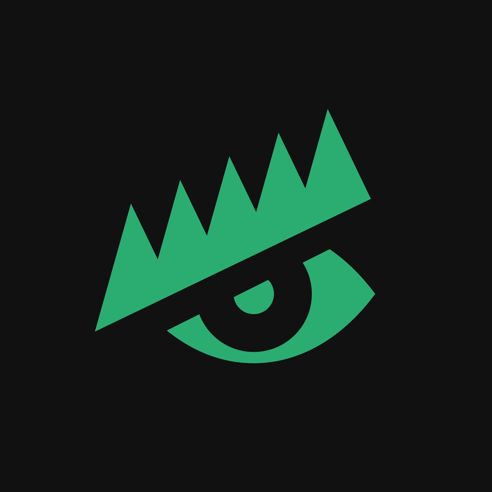
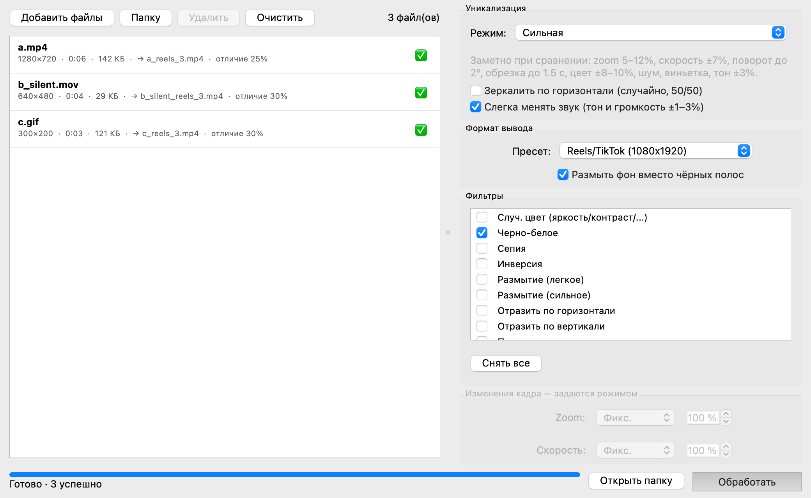

<p align="center"></p>
<h1 align="center">VidUniq</h1>
<p align="center"><b>Русский</b> · <a href="README.en.md">English</a></p>
<p align="center">Уникализатор видео для Reels, TikTok, Shorts, Instagram, VK, Telegram и других соцсетей.<br>
Нативное приложение для macOS (Apple Silicon) — FFmpeg уже внутри, ничего устанавливать не нужно.</p>

> Форк [0xd5f/Video-Uniqueizer](https://github.com/0xd5f/Video-Uniqueizer) с переработанным интерфейсом, исправленной обработкой и готовой сборкой `.dmg`.

## Скачать

**[Releases → VidUniq-x.y.z-arm64.dmg](https://github.com/f0q/VidUniq/releases/latest)** — macOS 12+, Apple Silicon (M1–M4).

1. Откройте `.dmg` и перетащите **VidUniq** в **Applications**.
2. Запустите. При первом запуске macOS покажет предупреждение — см. ниже, это нормально.

> [!IMPORTANT]
> **«Не удаётся проверить разработчика» / «Приложение повреждено» — это не вирус и не ошибка.**
> Apple берёт $99 в год за сертификат подписи, а VidUniq — бесплатный open-source проект без такого сертификата.
> macOS одинаково ругается на **любое** неподписанное приложение. Исходный код открыт, сборка делается публично
> в [GitHub Actions](https://github.com/f0q/VidUniq/actions) — вы можете проверить, что в `.dmg` попало ровно то, что в репозитории.
>
> **Как открыть (один раз):**
> - дважды кликните **«Снять карантин.command»** из образа диска (после копирования VidUniq в Applications), **или**
> - **Системные настройки → Конфиденциальность и безопасность**, прокрутите вниз → **«Открыть всё равно»**, **или**
> - в Терминале: `xattr -cr /Applications/VidUniq.app`
>
> Дальше приложение открывается обычным двойным кликом.

## Возможности

- Массовая обработка видео и GIF, перетаскивание файлов **и папок** в любое место окна
- 17 пресетов под соцсети (Reels/TikTok, Shorts, Instagram Post/Story/Portrait/Landscape, VK, Telegram, YouTube, Facebook, Twitter, Snapchat, Pinterest) — **все работают**, с чёрными полями или размытым фоном
- Фильтры: случайный цвет, ч/б, сепия, инверсия, размытие, отражение, пикселизация, VHS, контраст/насыщенность/яркость, тёплый/холодный
- Zoom и скорость — фиксированные или случайные в диапазоне для каждого файла
- Наложение картинки или GIF в 9 позициях
- Очистка метаданных, удаление звука
- Аппаратное кодирование VideoToolbox на Apple Silicon (в несколько раз быстрее), с автоматическим откатом на libx264
- Реальный прогресс по каждому файлу и общий, кнопка «Отмена», ошибки по файлам не прерывают очередь
- Настройки запоминаются между запусками; окно сжимается до 880×520; светлая и тёмная тема macOS

<p align="center"></p>

## Telegram-бот на сервере

Тот же функционал через Telegram: прислали видео → получили уникализированную копию (или несколько вариантов сразу). Ставится на любой Linux-сервер за 5 минут через Docker, файлы до 2 ГБ, доступ только для ваших Telegram ID.

```bash
git clone https://github.com/f0q/VidUniq.git && cd VidUniq/deploy
cp .env.example .env && nano .env && docker compose up -d
```

Подробно: **[docs/bot.md](docs/bot.md)**

## Что изменилось по сравнению с оригиналом

| Было | Стало |
|---|---|
| PyQt5, QSS-темы, на macOS выпадающие меню сливались с фоном | PySide6 (Qt 6), нативный стиль, системная тёмная тема |
| Окно нельзя уменьшить по высоте | Панель настроек прокручивается, минимум 880×520 |
| Drag&drop только на список | Drop на всё окно, папки разворачиваются рекурсивно, подсказка при перетаскивании |
| Из 17 форматов реально работал только Reels/TikTok | Все пресеты масштабируют/дополняют кадр; размытый фон для любого |
| Zoom для «Оригинальный» дополнял кадр до 1080×1920 | Zoom кадрирует/дополняет до исходного размера |
| Видео без звуковой дорожки → ошибка ffmpeg | Тихая дорожка добавляется автоматически |
| Прогресс только по числу файлов, отмены нет | Прогресс по времени внутри файла, «Отмена» убивает ffmpeg и удаляет недописанный файл |
| Папка вывода запрашивалась каждый раз | «Рядом с исходником в `uniq/`» или своя папка; настройки сохраняются |
| Нужно ставить Python, зависимости и ffmpeg вручную | `.dmg` со всем внутри |

## Roadmap

Проект развивается по мере интереса. **Поставьте ⭐ репозиторию** — это главный сигнал, что стоит продолжать.

| Звёзд | Что появится |
|---|---|
| ✅ сейчас | macOS Apple Silicon `.dmg`, все пресеты, VideoToolbox, прогресс и отмена; Telegram-бот (бета) |
| **100 ⭐** | **Сборки для Windows (`.exe`) и macOS Intel** — под другие платформы |
| **150 ⭐** | **Telegram-бот для Linux-сервера** — 🧪 бета уже в репозитории ([docs/bot.md](docs/bot.md)); стабильная версия, публичный Docker-образ в релизах и доработки по отзывам |
| 250 ⭐ | Профили настроек (сохранять/загружать наборы под каждую соцсеть), несколько вариантов из одного видео за раз |
| 500 ⭐ | Параллельная обработка нескольких файлов, предпросмотр результата до запуска |

Идеи и баги — в [Issues](https://github.com/f0q/VidUniq/issues). Pull requests приветствуются.

## Запуск из исходников

Нужен Python ≥ 3.10 и ffmpeg/ffprobe (в `PATH`, например `brew install ffmpeg`, либо в `vendor/ffmpeg/`).

```bash
git clone https://github.com/f0q/VidUniq.git && cd VidUniq
uv venv && uv pip install -e ".[gui,dev]"     # или: python3 -m venv .venv && .venv/bin/pip install -e ".[gui,dev]"
uv run python main.py
```

Тесты (`tests/test_integration.py` прогоняет реальный ffmpeg на синтетических роликах):

```bash
uv run pytest
```

## Сборка `.app` и `.dmg`

```bash
scripts/fetch_ffmpeg.sh    # статические ffmpeg + ffprobe (arm64) → vendor/ffmpeg/
scripts/build_mac.sh       # → dist/VidUniq.app и dist/VidUniq-<версия>-arm64.dmg
```

GitHub Actions (`.github/workflows/build-macos.yml`) собирает DMG на каждый пуш в `main`, а на тег `v*` публикует релиз.

## Структура

```
main.py                    точка входа
viduniq/app.py             QApplication, логирование (~/Library/Logs/VidUniq/app.log)
viduniq/core/constants.py  пресеты, фильтры, позиции наложения
viduniq/core/ffmpeg.py     поиск ffmpeg, probe, сборка команды, запуск с прогрессом
viduniq/core/worker.py     очередь обработки в QThread
viduniq/ui/                главное окно, список файлов, панель настроек
viduniq/bot/               Telegram-бот (aiogram): очередь, настройки, клавиатуры
deploy/                    Dockerfile, docker-compose.yml, systemd-unit для бота
scripts/                   fetch_ffmpeg.sh, make_icns.sh, build_mac.sh
VidUniq.spec               PyInstaller
```

## Лицензия и авторство

Оригинальный проект [Video-Uniqueizer](https://github.com/0xd5f/Video-Uniqueizer) написан [0xd5f](https://github.com/0xd5f) и опубликован без указания лицензии; этот форк распространяется на тех же условиях. В сборку входят статические бинарники [FFmpeg](https://ffmpeg.org) (GPL, сборка [martin-riedl.de](https://ffmpeg.martin-riedl.de)) и [Qt/PySide6](https://www.qt.io) (LGPL).
